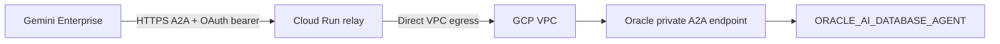

# Develop A2A Agents that use the Oracle Agent in Gemini Enterprise

## Introduction

This lab builds the private-network pattern for Gemini Enterprise to reach the Oracle AI Database agent. A small Cloud Run relay presents a public A2A surface, forwards the authenticated Oracle bearer token over the existing GCP VPC route, and hides the private database hostname from Gemini Enterprise.

### Objectives

- Understand the Gemini Enterprise -> Cloud Run -> Oracle A2A route.
- Deploy or inspect the private A2A relay.
- Register the relay card with OAuth in Gemini Enterprise.
- Validate authentication, Deep Data Security, and audit behavior.

### Architecture

The following flow keeps Gemini Enterprise on the public A2A surface while
the relay uses the VM/VPC path to reach Oracle's private endpoint:



The relay is a protocol and identity boundary, not a second database agent.
It forwards the authenticated user context and keeps the private Oracle
hostname out of Gemini Enterprise's public registration.

### Prerequisites

- Completed Lab 4 (and the preceding labs).
- GCP project and region with the Oracle Database@Google Cloud network attached.
- Cloud Run deployment permissions and a private Oracle A2A endpoint.
- Dedicated Oracle OAuth client and least-privileged database users.

## Task 1: Understand the network boundary

```text
Gemini Enterprise
  -> HTTPS + user Oracle OAuth bearer token
  -> Cloud Run private-A2A relay
  -> Direct VPC egress on the GCP VPC
  -> Oracle Database@Google Cloud network
  -> Oracle private A2A endpoint
  -> Oracle AI Database agent team
```

The relay must not store or log bearer tokens. Oracle remains responsible for database privileges, Select AI object lists, row filtering, and unified auditing.

## Task 2: Configure the relay

### 2.1 Prepare the workshop source

On the Lab 2 VM, use the workshop checkout created for the SQLcl scripts:

```bash
cd "$HOME/oracle-ai-database-gcp-gemini"
find . -maxdepth 2 -type d -name '*a2a*' -o -name 'private-a2a-proxy'
```

Keep the source checkout on the VM. It contains the database scripts and is
the host used for the later A2A deployment steps.

### 2.2 Configure deployment values

Use the `private-a2a-proxy/` container from the workshop source project as the starting point. Set these deployment-only values through Secret Manager or the deployment environment:

```bash
export GCP_PROJECT="YOUR_GCP_PROJECT"
export GCP_REGION="YOUR_GCP_REGION"
export PRIVATE_ORACLE_A2A_URL="https://PRIVATE_ORACLE_HOST/adb/a2a/v1/databases/YOUR_DATABASE_OCID/agents/oracle_ai_database_agent"
```

Deploy with Direct VPC egress to the VPC and subnet that can resolve the private Oracle hostname. Do not place an OCID, password, or OAuth secret in this markdown or in a public repository.

The environment variables identify deployment targets only. Store OAuth
client secrets and any database credentials in Secret Manager. The relay must
read the incoming bearer token for the request and must never persist or log
it.

The relay should allow only these methods:

```text
message/send
message/stream
tasks/get
tasks/cancel
```

## Task 3: Validate the security contract

Run the following checks against the relay URL:

```bash
export RELAY_URL="https://YOUR_RELAY.run.app"
curl -i "$RELAY_URL/health"
curl -i "$RELAY_URL/.well-known/agent-card.json"
curl -i -X POST "$RELAY_URL/message/send" -H 'content-type: application/json' -d '{}'
```

Expected results:

- `/health` returns HTTP 200.
- The agent card advertises the relay, not the private Oracle hostname.
- A request without a bearer token returns HTTP 401.
- An invalid bearer token reaches Oracle and returns an Oracle authentication error rather than a network ACL error.

## Task 4: Register and test in Gemini Enterprise

1. Open Gemini Enterprise's custom agent or agent registration area.
2. Register the relay's `/.well-known/agent-card.json` URL. Confirm the card contains the public relay URL and does not expose the private Oracle hostname.
3. Associate the dedicated Oracle OAuth authorization resource described in the Oracle Developers guide.
4. Start a chat with the relay agent and authenticate as a permitted database user.
5. Ask for a region-scoped inventory risk summary.
6. Repeat as a restricted user and confirm only authorized rows are returned.

Use this prompt:

```text
Using the Oracle inventory risk data, list the products at risk in my authorized region. Include probability, projected revenue impact, and the warehouse driving the risk.
```

## Task 5: Verify audit and rollback

1. Query `UNIFIED_AUDIT_TRAIL` as an authorized auditor and confirm A2A activity is recorded.
2. Confirm the relay never logs bearer tokens, OAuth secrets, wallet paths, or database passwords.
3. Confirm the response is filtered by the authenticated database user's region and privileges.
4. Remove the custom Gemini Enterprise agent and delete the Cloud Run relay to roll back. The Oracle private endpoint and database agent team remain unchanged.

## Conclusion

A2A carries messages between Gemini Enterprise and the Oracle agent; the relay makes the private network and identity boundary explicit. The next lab adds governed A2UI and MCP Apps experiences without allowing UI payloads or model output to bypass Oracle transaction controls.

## Acknowledgements

*All Done! You may proceed to the next lab.*

- **Authors/Contributors** - Paul Parkinson, Architect and Dev Advocate, Oracle AI Database
- **Last Updated By/Date** - Paul Parkinson, October 2026
