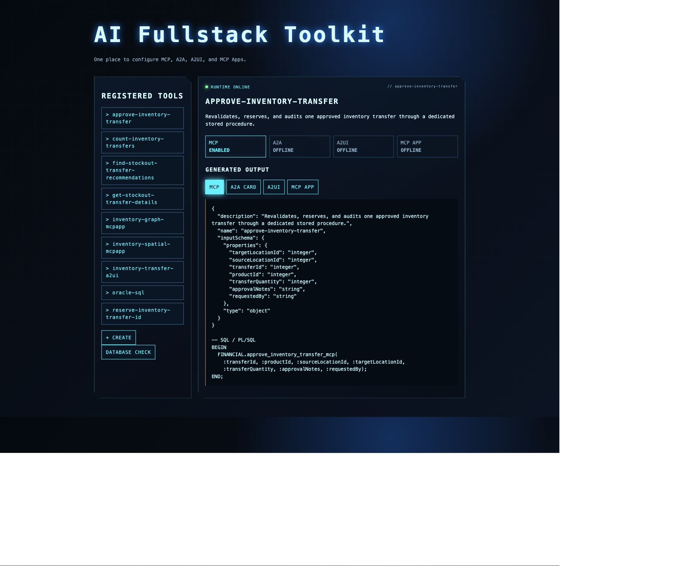
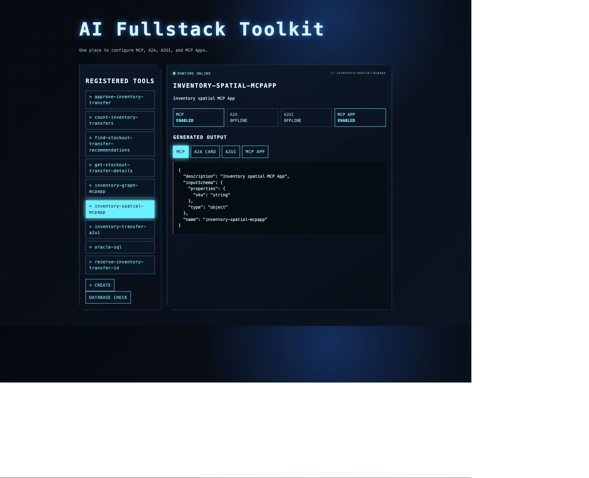
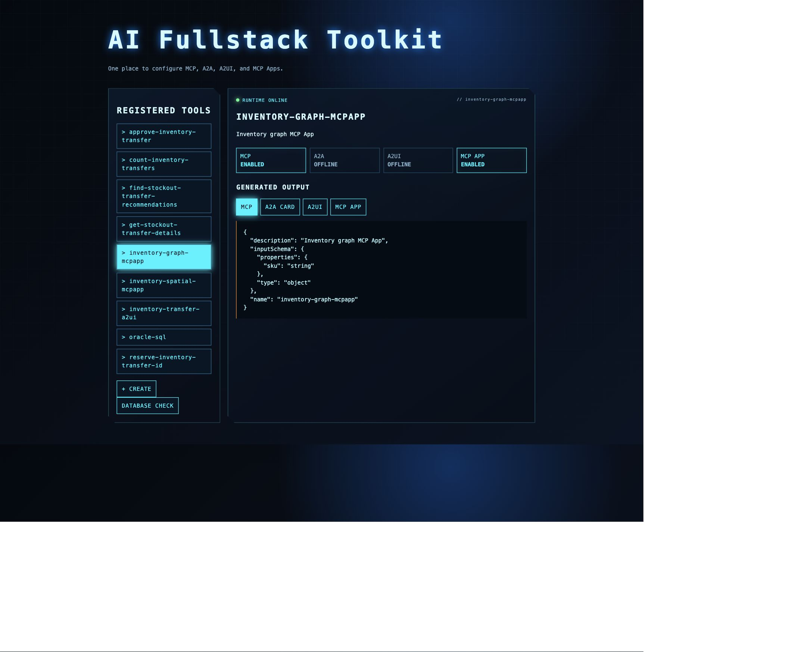
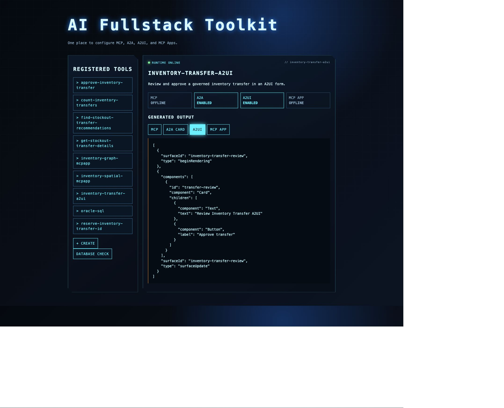
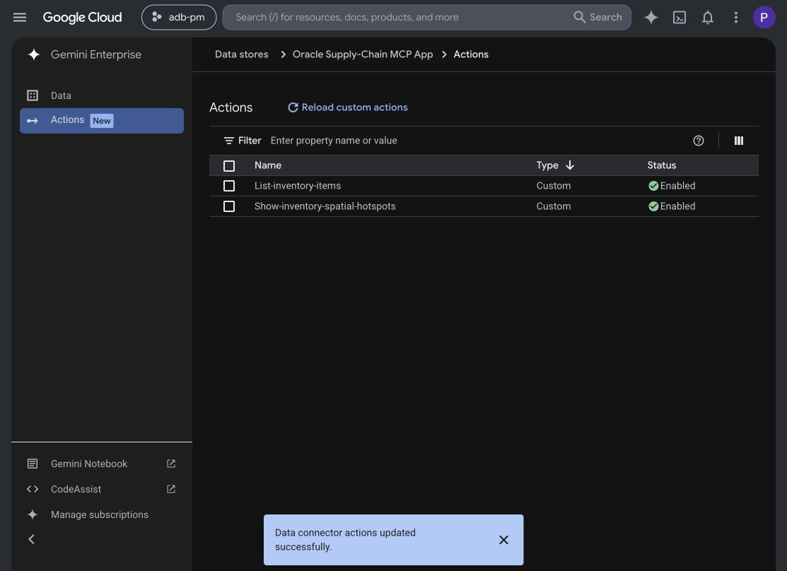

# Develop A2UI and MCPApps (charts, spatial, graph, ...)

## Introduction

Build two complementary lanes in the inventory application. MCP Apps provide
interactive, primarily read-only exploration for spatial hotspots and
property-graph dependencies. A2UI provides the agent-driven decision lane for
inventory recommendations, transfer review, and—once the governed write path
is enabled—explicit approval and execution. These are separate host paths over
the same Oracle-backed domain; do not force one UI protocol to do both jobs.

The graph example below shows another useful result shape: a property-graph traversal for `SKU-500`, with its supplier-to-warehouse path, a weather alert, and database-derived metrics. Use it as a visual reference when extending the lab's agent experience beyond text and recommendation cards.


*Example graph view: the Oracle property graph is the source of the traversal; A2UI or an MCP App controls how a compatible host presents it.*

### Objectives

- Understand the relationship between A2A, MCP, A2UI, and MCP Apps.
- Render an Oracle recommendation with an allowlisted A2UI catalog.
- Extend the existing Oracle Supply-Chain MCP connector with separate `ui://` resources for spatial and graph exploration.
- Keep the transfer MCP App disabled; transfer review belongs to the A2UI lane.
- Understand the implementation boundary between the current draft flow and a
  real actor-bound, short-lived approval/write path.

### Prerequisites

- Completed Lab 5.
- The agent service and Oracle inventory recommendation view available.
- Node.js 20.19+ or 22.12+ for the MCP App sample; Java 21 and Maven for the gateway.
- A configured managed Oracle AI Database Agent, reachable private A2A relay,
  and server-side OAuth client/refresh grant. See the
  [read-path runbook](https://github.com/paulparkinson/oracle-ai-database-gcp-gemini/blob/main/docs/MCP_APP_ORACLE_AGENT_SPATIAL.md)
  for local setup, cloud secrets, consent and verification.
- Gemini Enterprise preview access for A2UI, or an MCP Apps-compatible host.

## Task 1: Trace the contracts

```text
Gemini Enterprise -- A2A --> inventory-action coordinator -- Oracle/A2A/MCP --> Oracle AI Database
    ^                                      |
    +------------ A2UI review ------------+

MCP-compatible host -- MCP --> graph/spatial tool -- ui:// resource --> sandboxed MCP App
```

Keep the responsibilities distinct:

- **A2A** carries tasks and messages between Gemini Enterprise and a remote agent. In the supplied implementation, an A2A adapter calls the shared service and returns the result to Gemini Enterprise.
- **MCP** discovers and invokes tools or reads resources. The Oracle Database MCP Java Toolkit exposes named database operations; it is not the A2A transport or the UI.
- **A2UI** sends a declarative component tree and data model for the host to validate and render with its own approved native components. It is not generated HTML or JavaScript.
- **MCP Apps** associate an MCP tool with a developer-built `ui://` resource. A compatible host loads that UI in a sandbox and mediates its tool calls through a host bridge.

The supplied code-deep-dive demonstrates separate host adapters over the same governed backend. Gemini Enterprise receives A2UI v0.8 DataParts over A2A v0.3; the MCP Apps host loads developer-built `ui://` resources. These are distinct host paths: negotiate the version, component catalog, and MCP Apps bridge with each host instead of assuming the payloads are interchangeable.

## Task 2: Render graph, chart, and spatial results

1. Ask `Show the spatial hotspot map for SKU-500` to open the spatial MCP App. Verify warehouse hotspots and the schematic source/destination connection from the managed Oracle agent. This line is not road routing or an approved transfer. Task 3 covers setup if the connector is not ready.
2. Optional graph extension: if separately implemented/registered, open the graph MCP App and traverse the supplier → plant → port → warehouse path for `SKU-500`. The graph descriptor is not an enabled action on the current catalog/spatial connector. Verify its data against the governed graph/relational service.
3. Ask the A2A inventory-action agent: `Recommend an inventory action for SKU-500. Gather graph, spatial, and external evidence first, then render the transfer review as A2UI.`
4. Verify that the agent returns the proposed source, destination, quantity, policy result, and A2UI review controls.
5. For A2UI, map structured agent results into the host's advertised catalog and supported component types. Use host-rendered native controls; do not put arbitrary markup, scripts, or model-generated component definitions into the surface.
6. Keep visualization data access behind bounded server contracts. An MCP App is presentation code and must not choose a different product, route, quantity, or database operation than the service returned.

The visualization is a presentation of Oracle results, not an authority boundary. The browser or MCP App must not choose a different product, source, target, or transfer quantity than the governed service returned.

### What the local toolkit dashboard should show

The full-stack toolkit includes a runnable local dashboard that makes the
surface split visible before a Gemini Enterprise registration. Start it from
the toolkit repository:

```bash
cd "$HOME/oracle-ai-database-fullstack-toolkit"
mvn test
mvn -pl runtime -am spring-boot:run
```

Open `http://localhost:8080`. Confirm these entries:

1. `inventory-spatial-mcpapp` has MCP and MCP APP enabled.
2. `inventory-graph-mcpapp` has MCP and MCP APP enabled.
3. `inventory-transfer-a2ui` has A2A and A2UI enabled, while MCP and MCP APP
   are disabled.
4. `approve-inventory-transfer`, `reserve-inventory-transfer-id`, and
   `count-inventory-transfers` are visible as MCP definitions imported from the
   toolkit catalog. Expose the write tool only through authenticated approval.









The dashboard emits descriptors and example A2UI messages. It does not replace
the production MCP server, MCP Apps-compatible host, Gemini Enterprise A2A
registration, or database approval procedure.

## Task 3: Run the Oracle Supply-Chain MCP App from the correct repository

The maintained implementation is in
`oracle-ai-database-gcp-gemini/mcp-app`. In read-only mode it registers
`list-inventory-items` and `show-inventory-spatial-hotspots` on
the same **Oracle Supply Chain MCP App** connector. It is not a second
connector.

```bash
cd "$HOME/src/github.com/paulparkinson/oracle-ai-database-gcp-gemini/mcp-app"
npm ci --ignore-scripts
npm run typecheck
npm run build
```

If using the already-running workshop deployment, skip deployment and go
straight to the connector actions below. For a new GCP deployment, first
configure the project, private relay and existing Secret Manager OAuth secret
references using the linked runbook. From the application repository root run:

```bash
./deploy/gcp/deploy-oracle-agent-and-mcp-app.sh
```

Click **Reload custom actions** on the existing **Oracle Supply Chain MCP App**
connector, enable the catalog and spatial actions, and start a new conversation.
The Toolkit transfer-dashboard action is no longer offered in read-only mode.



*Actual connector configuration, October 4, 2026. Reload actions after schema
changes, not for each SKU. No second MCP connector is required.*

The spatial path is deliberately:

```text
Gemini Enterprise
  -> MCP App server
    -> Java gateway
      -> OAuth token exchange (or cached, valid access token)
        -> Oracle AI Database Agent via A2A/private relay
          -> validated spatial JSON
            -> GeoJSON -> MapLibre MCP App
```

The tool does not accept model-passed hotspot evidence and does not fall back
to the MCP Toolkit, static demo rows, or Select AI for spatial reads. Ask:

```text
Show the spatial hotspot map for SKU-500.
```

The gateway requests database rows containing PRODUCT_ID and WAREHOUSE_ID and
filters by product before constructing GeoJSON. It rejects conflicting rows,
invalid coordinates and hotspot scores outside 0–1. Source, destination and
relay roles stay distinct. Connections are schematic, not road routes.
Approval belongs to the separate A2UI/Toolkit workflow.

### Why the Java gateway is here

The gateway is a bounded adapter in the existing Java/Spring Boot application,
not another database or a replacement Oracle agent. Its `/api/inventory/catalog`
and `/api/inventory/spatial-hotspots` endpoints ask the managed agent to execute
fixed read-only queries and validate its returned rows. The spatial query
retrieves the scoped view; Java filters by per-row product ID. This demo
rejects results over 1,000 rows rather than silently treating them as complete.

This puts OAuth token renewal, timeouts and validation in one reusable service.
Client secrets/refresh grants stay in server configuration/Secret Manager,
not the MCP App iframe, model arguments or browser storage. Initial Oracle
consent still uses a browser; a valid refresh grant then supports repeated map
requests without repeated interactive consent. Access tokens are cached until
near expiry. Java is a reuse choice, not a requirement of MCP Apps or OAuth.

The stored grant identifies the gateway's Oracle caller, not automatically
each Gemini user. The supplied Cloud Run deployment permits public ingress
for the demo; production needs ingress/caller authorization, least privilege,
an explicit user-vs-service identity design and refresh-token lifecycle
handling. The current client does not persist rotated refresh tokens. See the
runbook before changing consent or deployment configuration.

### Demonstrate parameterized data, not a single canned prompt

Ask `Use List-inventory-items to list the managed Oracle inventory catalog and its scope.`
The audited SC_PRODUCTS catalog contains SKU-500, SKU-700, SKU-900,
SKU-APAC-210 and SKU-APAC-420. Try `Show the spatial hotspot map for SKU-700.`
Do not use the Toolkit SUPPLY_PRODUCTS transfer recommendations as this catalog.

These are live reads of **seeded Oracle demo tables**, not production inventory
telemetry or a frontend mock. Both the US and Singapore/Sydney warehouse rows
belong to this seeded dataset. “Live” describes querying Oracle at request time;
“seeded” describes how the demonstration data was initially populated.
The catalog and view can change. Discover the
current products first; these additional prompts exercise the same bounded
tools (wording alone does not guarantee Gemini's tool choice):

| Prompt | Expected check |
| --- | --- |
| List product IDs and names from the managed Oracle inventory catalog and show its scope. | Catalog action; `FINANCIAL.SC_PRODUCTS`. |
| Show the spatial hotspot map for SKU-APAC-210. | Singapore destination and Sydney source, instead of SKU-700's US warehouses. Both SKUs use the same seeded Oracle dataset. |
| Use Show-inventory-spatial-hotspots for SKU-900 and summarize only the returned roles and scores. | Every row belongs to SKU-900. |
| Map SKU-APAC-420, then map SKU-APAC-210 for comparison. | Two independent spatial calls, one SKU per result. |
| Show SKU-700 with maximumRows set to 2. | Display limit; inspect `totalRows`/`truncated`, not a smaller database scope. |
| Query SKU-700 again and show the new task ID and scope. | Fresh call; no continuous monitoring implied. |

Catalog, SKU-500, SKU-700, SKU-APAC-210 and no-data cases were covered by live
endpoint checks; SKU-700 and SKU-501 were also checked in Gemini. The other
phrasing examples illustrate supported inputs, not additional recorded UI
tests. `maximumRows` accepts 2–50 (default 20); the catalog takes no filter
arguments and the map takes no arbitrary SQL or evidence payload.


This October 4, 2026 screenshot is from a live managed-agent call, not a UI mock.
Clicking DFW displayed WH-202, SOURCE_BUFFER and hotspot score 0.36.
Pan/zoom keeps markers geographically anchored. Clicking inspects returned
data; it does not query Oracle again. Map tiles are separate OpenStreetMap
requests, not the source of warehouse evidence; preserve attribution and
configure permitted tile origins in the MCP resource CSP/network policy.

Test `Show the spatial hotspot map for SKU-501.` A NO_DATA result must say
risk is **unknown**, not safe/stable, and must not promise monitoring. An error
must not become an invented diagnosis or trigger a Toolkit fallback.
HOTSPOT_SCORE is a score, not a stockout probability.

### Verify the source at three levels

1. Expand Gemini's tool trace: expect the named catalog/spatial action.
   `Load Skill` is instruction loading, and Google Search is not an Oracle
   query. For an isolated test, disable Google Search and start a fresh chat.
   The Oracle call is behind the MCP action, so it need not appear as a
   separate agent card in Gemini. Do not treat host narration as evidence.
2. Test outside Gemini, from the application repository root:

   ```bash
   node mcp-app/test/live-evidence.mjs https://YOUR_MCP_SERVICE/mcp
   ```

   This issues read-only live catalog/multi-SKU/no-data calls, checks row
   identity and task IDs, and verifies that the Toolkit dashboard is not
   advertised. Inspect the raw gateway result and gateway/relay request logs
   using the runbook's commands; record time, deployed revision, scope, A2A
   task ID and each returned SKU/warehouse ID. Do not log tokens or secrets.
3. Independently compare returned rows using an authorized read-only Oracle
   SQL connection to the same schema. The runbook includes the exact SELECTs.
   For proof of that particular execution, correlate available Oracle agent
   query diagnostics/database audit records by time, identity and SQL.
   The returned `query` is requested SQL; an A2A task ID is not a database audit
   ID or signed execution receipt. Matching rows alone is not execution proof.

The recorded checks established the authenticated managed-agent call path and
validated results, **not independently correlated Oracle SQL audit records**.
If those records are unavailable, report the gap rather than claiming full
proof. Unit tests use fixtures; passing them is not proof of a live query.
Do not modify the database just to demonstrate liveness without authorization.

The [canonical runbook](https://github.com/paulparkinson/oracle-ai-database-gcp-gemini/blob/main/docs/MCP_APP_ORACLE_AGENT_SPATIAL.md)
contains local startup, deployment prerequisites, raw curl checks, read-only
SQL comparison, source-code trace and dated task/revision evidence.

## Task 4: Keep approval and database authority server-side

1. Request a recommendation and record its draft ID.
2. Review it in A2UI without editing product, source, destination, or quantity.
3. In the current repository state, confirm that the result remains a draft and no database write is called.
4. If you implement the write extension, bind approval to the authenticated actor and a short-lived, single-use handle bound to the exact recommendation.
5. Test replay, expiry, actor mismatch, changed route/quantity, insufficient stock, and rollback; each must fail without a partial write.

The MCP App is untrusted presentation code: its iframe must not receive database credentials, wallet files, or authority to select a transfer. For a future write-enabled A2UI flow, the service must validate the approval and Oracle must perform final row locks, current-stock revalidation, audit insert, and transfer update in one transaction. This keeps the database, not the model or UI, as the final execution authority.

## Task 5: Test failure and security cases

- Send malformed or unsupported A2UI component data; the host-side allowlist must reject it.
- Attempt an unapproved image or network origin in the MCP App; its content security policy must block it.
- Confirm the MCP App cannot access the host DOM, cookies, or local storage, and that host communication uses the MCP Apps bridge.
- Remove the actor identity; approval must fail.
- Expire the approval token; approval must fail.
- Attempt a model-visible write; no write-capable model tool should exist. The current draft implementation must not claim execution.
- Inspect logs for bearer tokens, passwords, or wallet paths; none may appear.

Keep the host's A2UI catalog allowlisted and the MCP App's content security policy narrowly scoped. Sandboxing protects the host boundary; it does not replace server authentication, input validation, database authorization, or transaction checks.

## Conclusion

A2UI and MCP Apps make the workflow usable without moving authority into the model or browser. Continue to Lab 7 to compare MCP server and application options for Oracle AI Database.

## Use this lab with ChatGPT or Claude

For reusable usage, verification and implementation guidance, see the
[`inventory-ui-architecture` agent skill](https://github.com/paulparkinson/oracle-ai-database-gcp-gemini/tree/main/.agents/skills/inventory-ui-architecture)
and the maintained
[`INVENTORY_UI_ARCHITECTURE.md`](https://github.com/paulparkinson/oracle-ai-database-gcp-gemini/blob/main/docs/INVENTORY_UI_ARCHITECTURE.md).
These instructions can be supplied to ChatGPT, Claude, or another coding
agent when extending the workshop application.

Copy this prompt (or supply the files locally if the assistant cannot open URLs):

```text
Read https://github.com/paulparkinson/oracle-ai-database-gcp-gemini/blob/main/.agents/skills/inventory-ui-architecture/SKILL.md
and its linked managed-agent runbook. Help me run and verify the catalog and
spatial MCP App using a SKU from the catalog. Keep reads on the managed Oracle
AI Database Agent path; do not use model-passed evidence or Toolkit fallback.
Explain what the observed evidence proves and what remains unverified.
Keep application changes in oracle-ai-database-gcp-gemini and workshop changes
in developer/multicloud-gcpagenticai-oracledb. Do not deploy or write inventory
without my explicit authorization.
```

Where the skill is installed/discovered in Codex, use
`$inventory-ui-architecture`. This user-facing development skill is not the
same as a Gemini runtime “Load Skill” step and does not itself query Oracle.

## Acknowledgements

*All Done! You may proceed to the next lab.*

- **Authors/Contributors** - Paul Parkinson, Architect and Dev Advocate, Oracle AI Database
- **Last Updated By/Date** - Paul Parkinson, October 2026
