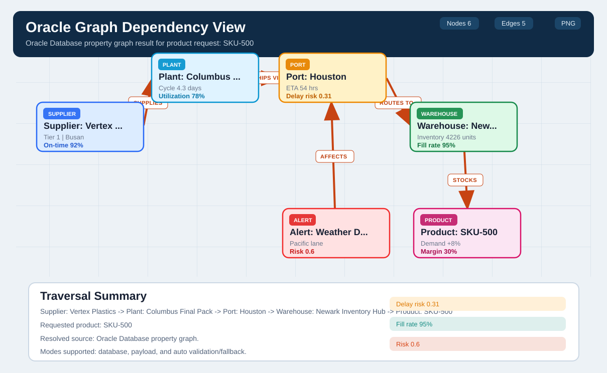

# Develop A2UI and MCPApps (charts, spatial, graph, ...)

## Introduction

Build a governed review experience for Oracle inventory recommendations. The same Oracle transaction is presented through A2UI to Gemini Enterprise and through an MCP App dashboard to compatible hosts. The model can request a read-only recommendation; only an explicit user action can approve or reject it.

The graph example below shows another useful result shape: a property-graph traversal for `SKU-500`, with its supplier-to-warehouse path, a weather alert, and database-derived metrics. Use it as a visual reference when extending the lab's agent experience beyond text and recommendation cards.



*Example graph view: the Oracle property graph is the source of the traversal; A2UI or an MCP App controls how a compatible host presents it.*

### Objectives

- Understand the relationship between A2A, MCP, A2UI, and MCP Apps.
- Render an Oracle recommendation with an allowlisted A2UI catalog.
- Register a `ui://` MCP App resource.
- Enforce actor-bound, short-lived approval at the service and database layers.

### Prerequisites

- Completed Lab 5.
- The agent service and Oracle inventory recommendation view available.
- Node.js 20+ for the MCP App sample.
- Gemini Enterprise preview access for A2UI, or an MCP Apps-compatible host.

## Task 1: Trace the contracts

```text
Gemini Enterprise -- A2A --> agent adapter -- MCP --> Oracle Database MCP Java Toolkit --> Oracle AI Database
    ^                         |                                                       |
    +------ A2UI DataParts ---+                                                       +-- governed data and transactions

MCP-compatible host -- MCP --> MCP server -- ui:// resource --> sandboxed MCP App
```

Keep the responsibilities distinct:

- **A2A** carries tasks and messages between Gemini Enterprise and a remote agent. In the supplied implementation, an A2A adapter calls the shared service and returns the result to Gemini Enterprise.
- **MCP** discovers and invokes tools or reads resources. The Oracle Database MCP Java Toolkit exposes named database operations; it is not the A2A transport or the UI.
- **A2UI** sends a declarative component tree and data model for the host to validate and render with its own approved native components. It is not generated HTML or JavaScript.
- **MCP Apps** associate an MCP tool with a developer-built `ui://` resource. A compatible host loads that UI in a sandbox and mediates its tool calls through a host bridge.

The supplied code-deep-dive demonstrates separate host adapters over the same governed backend. Gemini Enterprise receives A2UI v0.8 DataParts over A2A v0.3; the standalone browser example uses A2UI v0.9.1 over AG-UI. These are distinct host paths: negotiate the version and component catalog with each host instead of assuming the payloads are interchangeable.

## Task 2: Render graph, chart, and spatial results

1. In Gemini Enterprise, select the Oracle graph agent and ask: `Use the Oracle Database property graph to show supply-chain dependencies for SKU-500. Include the supplier, plant, port, warehouse, related alert, and product.`
2. Compare the returned traversal with the graph view above. Verify that the relationships and metrics come from Oracle results, and that the requested SKU is `SKU-500`.
3. Try the spatial agent with: `Show a map for SKU-500 and highlight warehouse hotspots plus the best relief route.` Then try the chart-capable agent with: `Chart the inventory risk for the top products and label each value with its Oracle source.` Confirm each visualization is backed by structured results rather than invented by the UI.
4. For A2UI, map structured agent results into the host's advertised catalog and supported component types. Use host-rendered native controls when available; do not put arbitrary markup, scripts, or model-generated component definitions into the surface.
5. For a graph, map, or chart that needs a custom rendering library or richer interaction, use an MCP App UI resource instead. Keep the visualization in the app and keep data access behind the server's bounded MCP tool contract.

The visualization is a presentation of Oracle results, not an authority boundary. The browser or MCP App must not choose a different product, source, target, or transfer quantity than the governed service returned.

## Task 3: Run the MCP App example

The supplied [reference application](https://github.com/oracle-devrel/oracle-ai-for-sustainable-dev/tree/main/a2ui_mcpapps_mcptoolkit) uses a shared Oracle-backed service with separate Gemini Enterprise A2A/A2UI and MCP Apps adapters. Clone it if it is not already available:

```bash
git clone https://github.com/oracle-devrel/oracle-ai-for-sustainable-dev.git
cd oracle-ai-for-sustainable-dev/a2ui_mcpapps_mcptoolkit/mcp-app
```

Configure and start the shared service and Oracle Database MCP Java Toolkit by following the reference application's README. Then, from its `mcp-app` directory:

```bash
npm install
npm run build
npm run dev
```

Register the server resource as a `ui://` MCP App with a compatible host. Invoke the dashboard tool and compare the rendered result with the A2UI surface: both paths should show the same Oracle-backed business result while using different UI contracts. Keep the model-visible recommendation tool read-only. The app-only approve and reject tools must require explicit user interaction and must not be callable by the model.

## Task 4: Keep approval and database authority server-side

1. Request a recommendation and record its ID.
2. Approve it in the UI without editing product, source, target, or quantity.
3. Confirm the service binds approval to the authenticated actor and a short-lived, single-use approval handle bound to the exact recommendation.
4. Attempt to reuse the handle, change the recommendation, or approve as another actor. Each attempt must fail.
5. Reject a recommendation and confirm no database write is called.

The MCP App is untrusted presentation code: its iframe must not receive database credentials, wallet files, or authority to select a new transfer. The service validates the action, and Oracle performs final row locks, current-stock revalidation, audit insert, and reservation in one transaction. This keeps the database, not the model or UI, as the final execution authority.

## Task 5: Test failure and security cases

- Send malformed or unsupported A2UI component data; the host-side allowlist must reject it.
- Attempt an unapproved image or network origin in the MCP App; its content security policy must block it.
- Confirm the MCP App cannot access the host DOM, cookies, or local storage, and that host communication uses the MCP Apps bridge.
- Remove the actor identity; approval must fail.
- Expire the approval token; approval must fail.
- Attempt a model-visible write; no write-capable model tool should exist.
- Inspect logs for bearer tokens, passwords, or wallet paths; none may appear.

Keep the host's A2UI catalog allowlisted and the MCP App's content security policy narrowly scoped. Sandboxing protects the host boundary; it does not replace server authentication, input validation, database authorization, or transaction checks.

## Conclusion

A2UI and MCP Apps make the workflow usable without moving authority into the model or browser. Continue to Lab 7 to compare MCP server and application options for Oracle AI Database.

## Acknowledgements

- A2UI v0.9.1 specification
- MCP Apps extension documentation
- [Develop A2UI and MCP Apps with Oracle AI Database and the Java MCP Toolkit](https://paul-parkinson.medium.com/develop-a2ui-and-mcp-apps-with-oracle-ai-database-and-the-java-mcp-toolkit-running-in-google-gemini-b495abf9b949)
- [A2UI and MCP Apps with Oracle Database and the Java MCP Toolkit](https://www.youtube.com/watch?v=FZGAqpYul1A)
- [Code deep dive: A2UI and MCP Apps](https://www.youtube.com/watch?v=iAASqFO7AKw)
- [Oracle Database MCP Java Toolkit sample application](https://github.com/oracle-devrel/oracle-ai-for-sustainable-dev/tree/main/a2ui_mcpapps_mcptoolkit)
- Oracle MCP Toolkit integration plan and security notes
