# Provisioning Autonomous Database and Populate Tables

## Introduction

This lab provisions Oracle Database@Google Cloud Autonomous Database and prepares the graph and inventory sample tables used by later labs.

Estimated Time: 10 minutes

### Objectives

As a database user, DBA or application developer:

1. Create an ODBG network.
2. Provision an Autonomous Transaction Processing database.
3. Populate the supply-chain graph and inventory-risk sample tables.

### Required Artifacts

- A Google Cloud account and an existing VPC network to associate with Oracle Database@Google Cloud. If you still need to create the VPC, complete Task 1 of Lab 4 first, then return here.

## Task 1: Create an ODBG Network

In this section, you will create an ODBG Network. **ODBG networks** provide secure and private connectivity to your Oracle Database resources, giving you control over how they connect and communicate.

1.	Login to Google Cloud Console (console.cloud.google.com) and search for **Oracle Database** in the **Search Bar** on the top of the page. Click on **Oracle Database@Google Cloud**.

    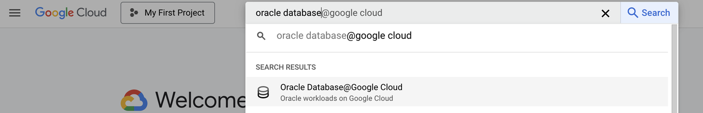

- Click **ODBG network** from the left menu.

    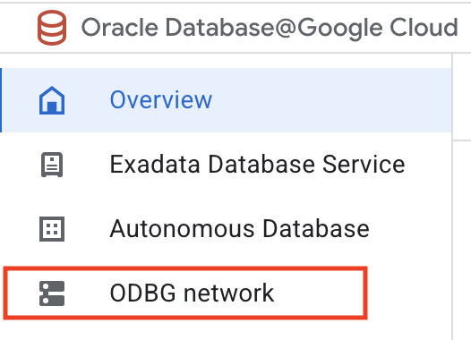

- Click **Create** on the ODBG network page.

    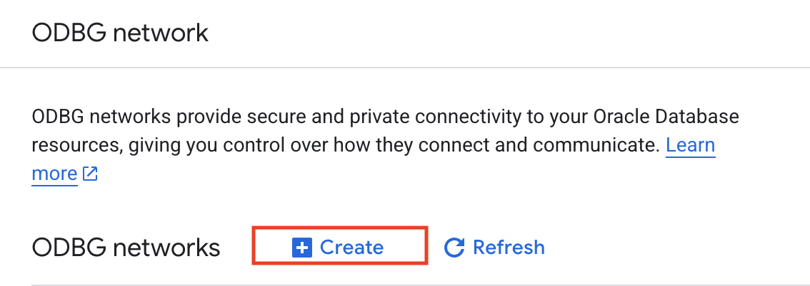

-  This will bring up the **Create ODBG network** screen where you specify the configuration of the ODBG network.

- Enter the following for **ODBG network**:

    * **Associated network** - app-network
    * **Region** - us-east4
    * **ODBG network name** - odbg-network

    Click **Create**.

    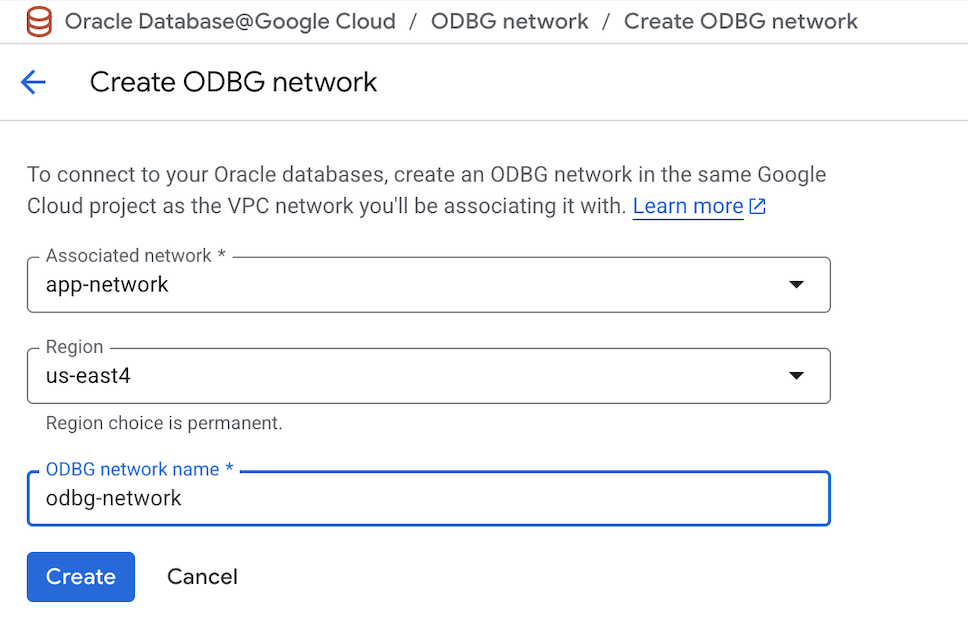

- On the **ODBG network** page click on the ODBG network that we just created **odbg-network**.

    

- On the **ODBG network details** page click **Create** to create a Subnet.

    

- Enter the following for **ODBG subnet**:

    * **Subnet name** - db-subnet
    * **Subnet range** - 10.2.0.0/24
    * **Subnet type** - Client

    Click **Create**.

    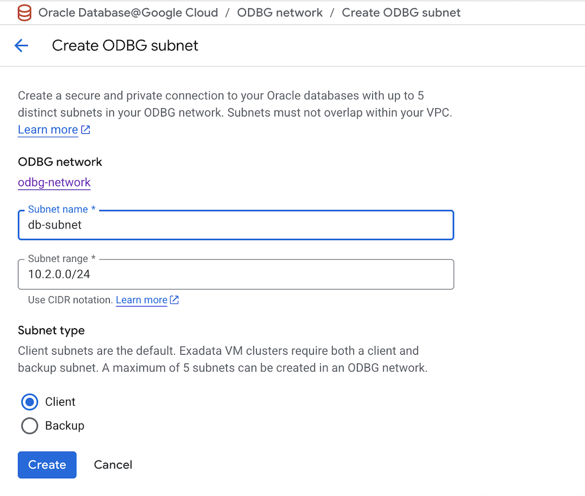

- On the **ODBG network details** page, verify the details of the ODBG Network and confirm the **Status** of subnet **db-subnet** is set to **Available**.

    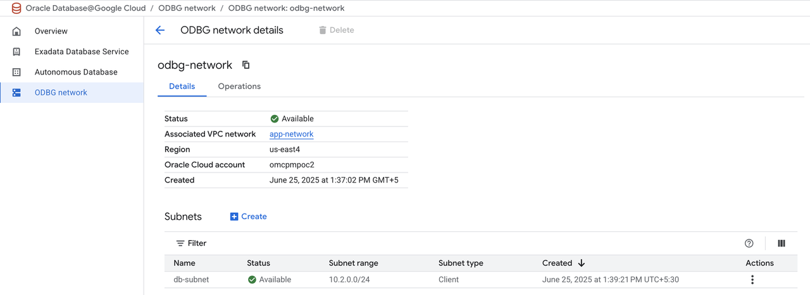

## Task 2: Create Autonomous Database

In this section, you will be provisioning an Autonomous Database using the Google Cloud Console.

1.	Login to Google Cloud Console (console.cloud.google.com) and search for **Oracle Database** in the **Search Bar** on the top of the page. Click on **Oracle Database@Google Cloud**.

    

-  Click **Autonomous Database** from the left menu.

    

- Click **Create** on the Autonomous Database details page.

    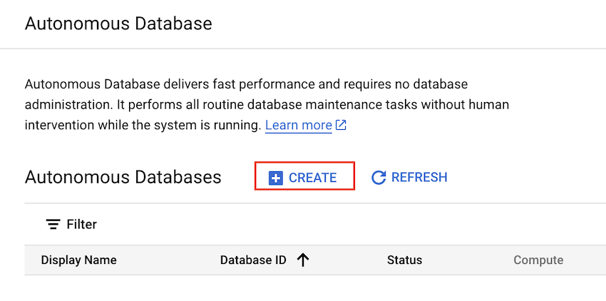

-  This will bring up the **Create an Autonomous Database** screen where you specify the configuration of the database.

- Enter the following for **Instance details**:

    * **Instance ID** - adb-gcp
    * **Database name** - adbgcp
    * **Database display name** - Autonomous-Database-GCP
    * **Region** - us-east4

    

- Select **Transaction Processing** for **Workload configuration**

    

- Leave all defaults for **Database configuration**

    

- Enter the password for admin user under **Administrator credentials**

    

- Under the **Networking** section, select **Private endpoint access only** for **Access type**.

- For **Private endpoint**, enter the following:

    * **Network project** - Select the default project name for the VPC network
    * **ODBG Network** - odbg-network
    * **Client subnet** - db-subnet (10.2.0.0/24)

    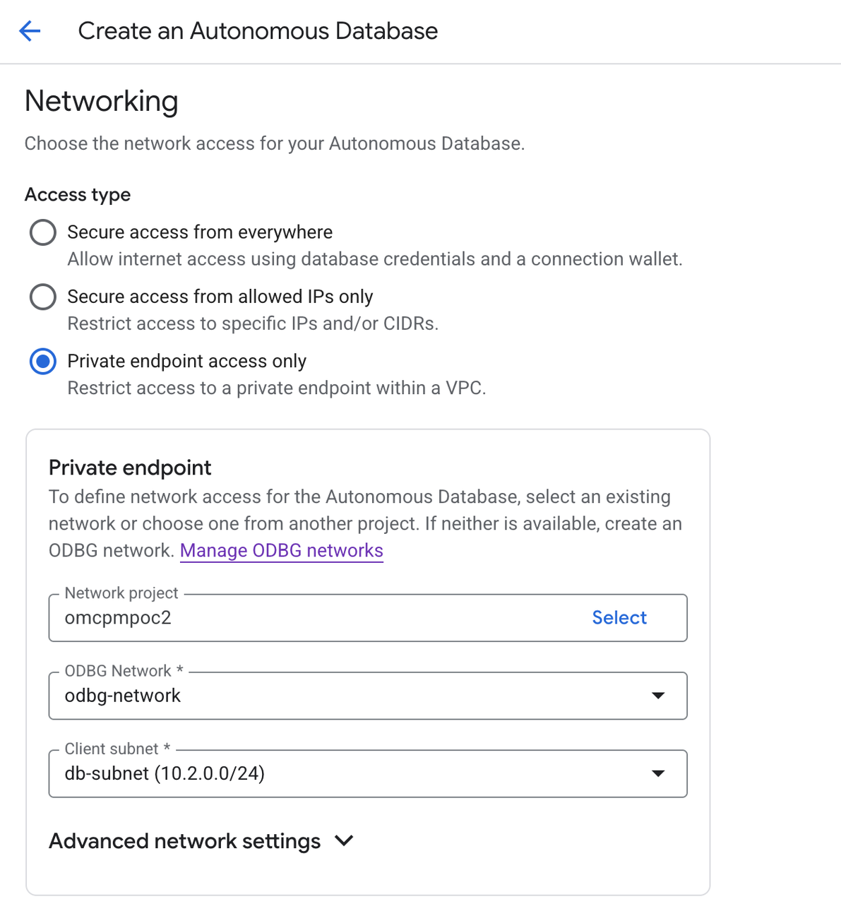

- Leave the rest as defaults and click **CREATE** to create the Autonomous Database.

    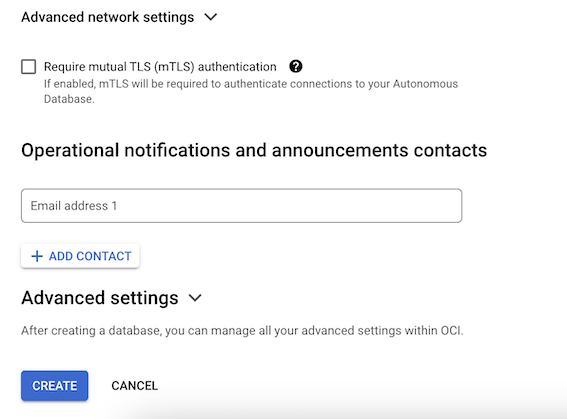

- Post creation the Autonomous Database will appear on the **Autonomous Database** page.

    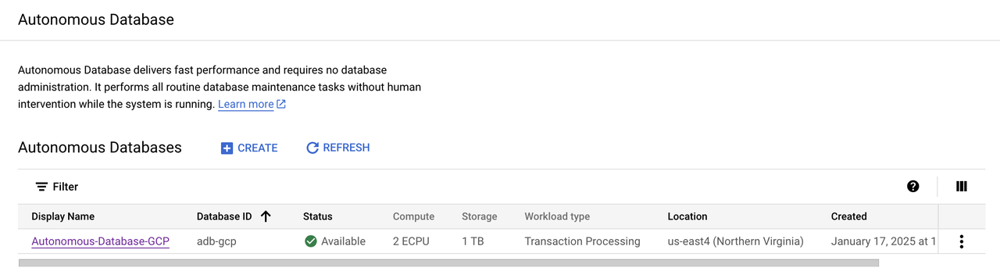

## Task 3: Download the Autonomous Database wallet file

**Oracle Autonomous Database** only accepts secure connections to the database. This requires a **'wallet'** file that contains the SQL\*NET configuration files and the secure connection information. Wallets are used by client utilities such as SQL Developer, SQL\*Plus etc.

- On the **Autonomous Database** page click the Autonomous Database that was provisioned.

    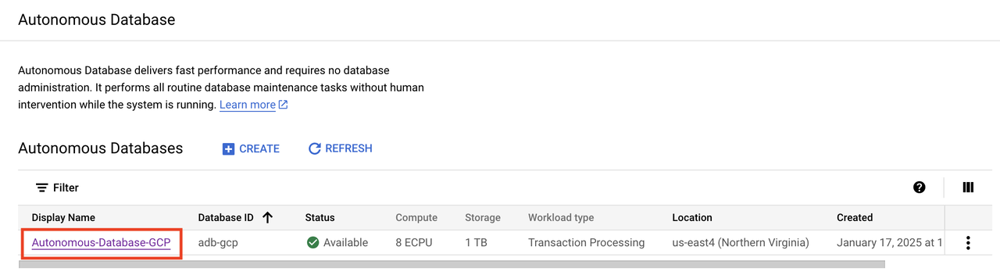

- Go to the **CONNECTIONS** tab.

    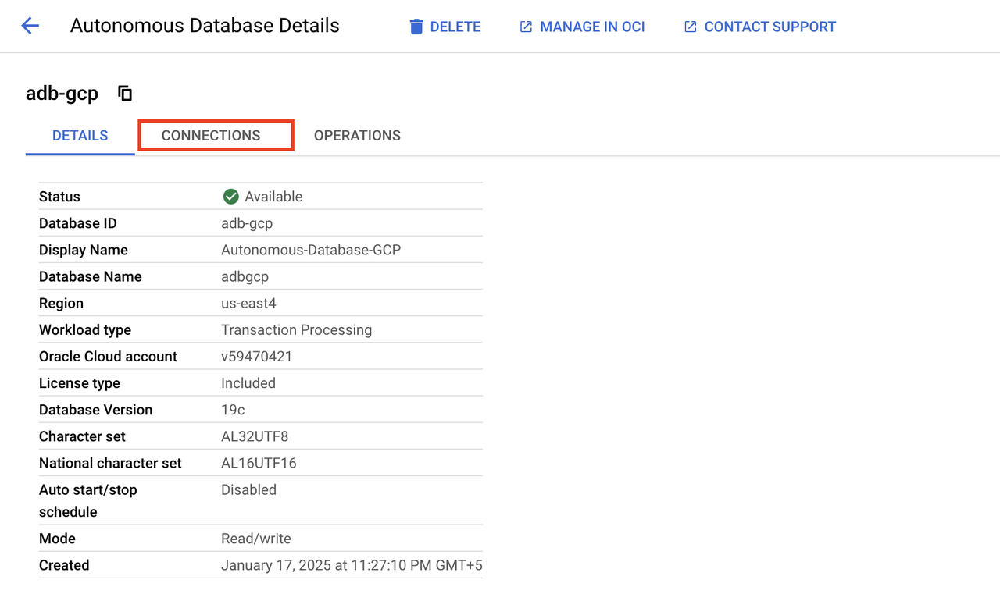

- Click **DOWNLOAD WALLET** on the **Connections** page.

    

- Set a password for the wallet on the **Download your wallet** page and click **DOWNLOAD**

    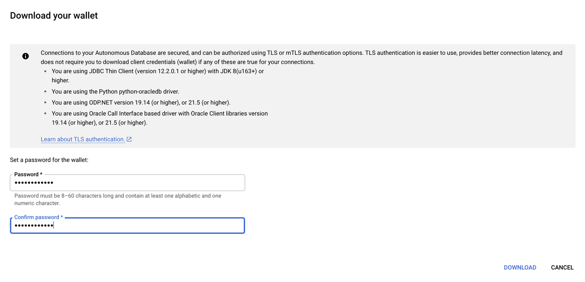
    
- Create a folder named **wallet** on the Compute VM instance and scp or Copy over the Wallet zip file to wallet folder on the VM instance. If you are using a Linux Terminal, run the following command to copy over the wallet to the VM instance -

    ```
    <copy>
    scp -i <private_key_file> Wallet_db_name.zip <Compute_VM_IP>:/home_directory/wallet/.
    </copy>
    ```

- Login to the Compute VM and unzip the database wallet that was uploaded in the previous step.

    ```
    <copy>
    cd wallet
    sudo apt install unzip
    unzip Wallet_db_name.zip
    </copy>
    ```

This database uses a private endpoint. If you do not already have a SQLcl client with a route to the database, complete Lab 4 to create the GCP VM, then return here to finish Tasks 4 and 5 before using the database in Labs 2 and 3.

## Task 4: Clone the sample repository

Run these commands on the SQLcl machine. For the standard private-endpoint setup, use the GCP VM from Lab 4. If the repository was already cloned on that machine, reuse the existing checkout.

```bash
git clone https://github.com/paulparkinson/oracle-ai-database-gcp-gemini.git
cd oracle-ai-database-gcp-gemini
```

## Task 5: Populate the sample tables

The [data tables README](https://github.com/paulparkinson/oracle-ai-database-gcp-gemini/blob/main/sql/DATA_TABLES_README.md) documents SQLcl scripts. SQLcl is the recommended path here because it runs the checked-out files in order and prompts for database passwords. Install it from [Oracle SQLcl Downloads](https://www.oracle.com/database/sqldeveloper/technologies/sqlcl/download/) if it is not already available on the VM. Keep `TNS_ADMIN` set to the directory containing the extracted wallet, then connect using a service alias from the wallet's `tnsnames.ora` file:

```bash
export TNS_ADMIN="$HOME/wallet"
sql ADMIN@your_adb_service_alias
```

Enter the `ADMIN` password when prompted. The README targets a `FINANCIAL` schema but does not create it. Check whether the schema already exists; only if it does not, create it as `ADMIN` and grant the required table privileges:

```sql
SELECT username FROM all_users WHERE username = 'FINANCIAL';

CREATE USER FINANCIAL IDENTIFIED BY "Replace_With_A_Strong_Password";
GRANT CREATE SESSION, CREATE TABLE TO FINANCIAL;
ALTER USER FINANCIAL QUOTA 100M ON DATA;
```

If the query returns `FINANCIAL`, do not run the `CREATE USER` statement. Confirm that the existing schema can create tables and has quota on `DATA`.

Still connected as `ADMIN`, run the one-time preparation script:

```sql
@sql/admin_prepare_paulparkdb_demo.sql
EXIT
```

Reconnect as `FINANCIAL`, enter its password when prompted, and run these scripts in order:

```bash
sql FINANCIAL@your_adb_service_alias
```

```sql
@sql/setup_supply_chain_graph_schema.sql
@sql/seed_supply_chain_graph_data.sql
@sql/setup_inventory_risk_demo_schema.sql
@sql/seed_inventory_risk_demo_data.sql
```

Verify the created tables, views, and graph:

```sql
SELECT object_name, object_type, status
FROM user_objects
WHERE object_name LIKE 'SC_%' OR object_name = 'SUPPLY_CHAIN_GRAPH'
ORDER BY object_type, object_name;
```

The scripts are intended to be rerunnable. Review errors and existing-object messages; do not drop objects in a shared database. The source README documents the SQLcl command-line workflow, not a Database Actions SQL Worksheet workflow, so SQLcl on the Lab 4 VM is the clearest and most reproducible option for this private-endpoint setup.

You may now **proceed to the next lab**.

## Acknowledgements

*All Done! You have successfully deployed your Autonomous Database instance and is available for use now.*

- **Authors/Contributors** - Vivek Verma, Master Principal Cloud Architect, North America Cloud Engineering
- **Last Updated By/Date** - Vivek Verma, July 2025