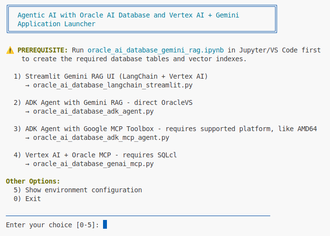
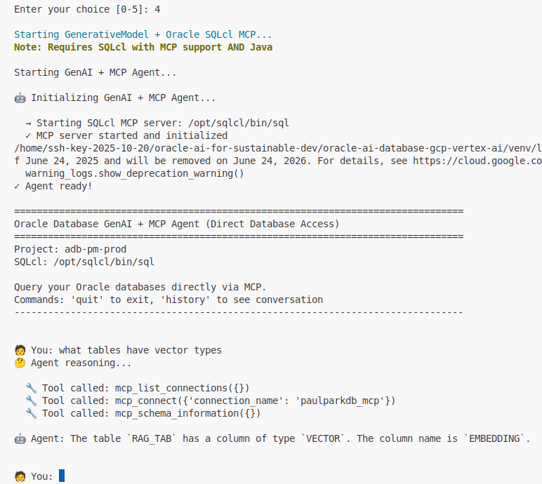

# Oracle AI Database RAG with Google Vertex AI Agents

## Introduction

<<<<<<< HEAD
This lab demonstrates building an AI agent using Google's Agent Development Kit (ADK) with Oracle AI Database vector search. You'll learn how to implement a production-ready ADK agent that combines multi-step reasoning with vector-based retrieval augmented generation (RAG).

The ADK provides a code-first approach to building agents with full control over behavior, tools, and workflows. This contrasts with Agent Builder's no-code interface (covered in a separate lab).

Estimated Time: 1 hour

### Objectives

* Set up Oracle Database vector store with 768-dimensional embeddings
* Create Streamlit UI for document management
* Implement ADK agent with custom Oracle RAG tool
* Test multi-step reasoning and conversation context

### Prerequisites

* Oracle AI Database (and wallet) and GCP compute instance - both configured in previous labs
* The GCP compute instance is configured for remote VS Code access and that environment has Python 3.12+, Git, etc. pre-installed
* Basic understanding of REST APIs and vector embeddings

## Task 1: Environment Setup

1. In the VS Code/terminal running on your GCP compute instance, clone the repository:
   ```
   bash
   <copy>
   git clone https://github.com/paulparkinson/interactive-ai-holograms.git
   cd interactive-ai-holograms/oracle-ai-database-gcp-vertex-ai
   </copy>
   ```

2. Run theConfigure Oracle Database:

   Run the first 
   
   Upload the database wallet and extract files in `./Wallet_PAULPARKDB` directory.

   Copy over the example .env file so you can edit it...
   ```
   bash
   <copy>
   cp .env_example .env
   </copy>
   ```
   Provide all config/environment information for database, etc. in .env file...

3. Create RAG table in the database:
   ```
   sql
   <copy>
   CREATE TABLE rag_tab (
       id NUMBER GENERATED ALWAYS AS IDENTITY,
       text VARCHAR2(4000),
       link VARCHAR2(500),
       embedding VECTOR(768, FLOAT32)
   );

   CREATE VECTOR INDEX rag_idx ON rag_tab(embedding)
   ORGANIZATION INMEMORY NEIGHBOR GRAPH
   DISTANCE COSINE;
   </copy>
   ```

4. Configure GCP:
   ```
   bash
   <copy>
   gcloud config set project adb-pm-prod
   gcloud config set compute/region us-central1
   gcloud auth login
   gcloud auth application-default login
   </copy>
   ```

5. Create environment variables file (`.env`):
   ```
   bash
   <copy>
   cat > .env << 'EOF'
   # Oracle Database
   DB_USERNAME=ADMIN
   DB_PASSWORD=your_password
   DB_DSN=paulparkdb_tp_high
   DB_WALLET_PASSWORD=your_wallet_password
   DB_WALLET_DIR=./Wallet_PAULPARKDB

   # Google Cloud
   GCP_PROJECT_ID=adb-pm-prod
   GCP_REGION=us-central1

   # API Configuration
   ORACLE_RAG_API_URL=http://10.150.0.8:8501
   API_PORT=8501
   STREAMLIT_PORT=8502
   EOF
   </copy>
   ```

6. Install dependencies:
   ```
   bash
   <copy>
   pip install -r requirements.txt
   </copy>
   ```

   Key dependencies include:
   - `langchain>=1.0.0` - LangChain framework
   - `langchain-google-vertexai>=3.2.0` - Vertex AI integration
   - `oracledb` - Oracle database driver
   - `fastapi` - REST API framework
   - `streamlit` - UI framework
   - `vertexai` - Google Vertex AI SDK

   

## Task 2: Document Ingestion with Streamlit

1. Understanding the Streamlit UI architecture:
   
   File: `oracle_ai_database_langchain_streamlit.py`
   
   The Streamlit application provides:
   - PDF upload and parsing (PyPDF2)
   - Text chunking with CharacterTextSplitter (1000 chars, 200 overlap)
   - Vertex AI embeddings generation using `text-embedding-004` (768 dimensions)
   - Oracle Vector Store insertion

2. Start the Streamlit UI:
   ```
   bash
   <copy>
   ./run_oracle_ai_database_langchain_streamlit.sh
   </copy>
   ```

   Access the UI at `http://your-vm-ip:8502`

   

3. Upload documents:
   
   - Click "Upload PDF Document"
   - Select a PDF file (e.g., Oracle Database documentation)
   - Monitor the processing pipeline:
     - Text extraction
     - Chunking
     - Embedding generation
     - Database insertion

4. Verify document storage:
   ```
   sql
   <copy>
   SELECT COUNT(*) FROM rag_tab;
   -- Should show number of chunks
   
   SELECT * FROM rag_tab WHERE ROWNUM <= 5;
   -- View sample chunks
   </copy>
   ```

5. Test search functionality:
   
   In the Streamlit UI:
   - Enter query: "What are new spatial features?"
   - View retrieved chunks and generated answer
   - Observe timing metrics (vector search vs. LLM response time)

   

## Task 3: Implement ADK Agent

1. Understanding Google ADK (Agent Development Kit):
   
   ADK provides:
   - Multi-step reasoning: Agent makes multiple tool calls
   - Conversation context: Maintains history across turns
   - Custom tools: Create BaseTool subclasses for any capability
   - Extensibility: Easy to add new tools/capabilities
   - Full control: Complete control over agent behavior and workflows
   
   Comparison with Agent Builder (no-code):
   
   | Feature | Agent Builder | ADK |
   |---------|---------------|-----|
   | Deployment | Managed service | Custom code |
   | UI | Built-in web UI | Build your own |
   | Reasoning | Dialogflow-based | Multi-step LlmAgent |
   | Customization | Limited | Full control |
   | Learning Curve | Low | Medium |

2. Understanding ADK architecture:
   
   File: `oracle_ai_database_adk_agent.py`
   
   ```
   python
   <copy>
   # 1. Initialize Vertex AI and Gemini
   vertexai.init(project=project_id, location=location)

   # 2. Define function declarations
   query_function = FunctionDeclaration(
       name="query_oracle_database",
       description="Search Oracle knowledge base...",
       parameters={...}
   )

   # 3. Create tool with functions
   oracle_tool = Tool(function_declarations=[query_function])

   # 4. Create Gemini model with tools
   model = GenerativeModel(
       "gemini-2.0-flash-exp",
       tools=[oracle_tool],
       system_instruction=instructions
   )

   # 5. Query with function calling
   chat = model.start_chat()
   response = chat.send_message(user_input)

   # 6. Handle function calls iteratively
   while response.has_function_call:
       result = execute_function(...)
       response = chat.send_message(function_response)
   </copy>
   ```

3. Key components:
   
   Custom BaseTool:
   ```
   python
   <copy>
   class OracleRAGTool(BaseTool):
       """Tool for searching Oracle Database knowledge base using vector similarity."""
       
       def __init__(self, vector_store: OracleVS, top_k: int = 5):
           self.vector_store = vector_store
           self.top_k = top_k

       def __call__(self, query: str, top_k: int = None) -> dict:
           """Search for relevant documents.
           
           Args:
               query: Natural language search query
               top_k: Number of results to return (default: 5)
           
           Returns:
               dict with 'documents' list and 'count'
           """
           k = top_k or self.top_k
           docs = self.vector_store.similarity_search(query, k=k)
=======
This lab demonstrates building AI agents using Google's Agent Development Kit (ADK) and Model Context Protocol (MCP) with Oracle AI Database 26ai vector search. You'll learn how to implement different agent architectures that combine multi-step reasoning with vector-based retrieval augmented generation (RAG).

The ADK provides a code-first approach to building agents with full control over behavior, tools, and workflows. This contrasts with Agent Builder's no-code interface (covered in a separate lab).

**Prerequisites:** You must complete the previous RAG lab ([adb-ai.md](../adb-ai/adb-ai.md)) which covers:
- Setting up the Python environment with venv
- Running the Jupyter notebook to create vector tables
- Understanding basic RAG concepts with Streamlit UI

Estimated Time: 45 minutes

### Objectives

* Implement ADK agents with custom Oracle AI Database tools
* Use Google MCP Toolbox for database operations
* Integrate Vertex AI with Oracle SQLcl MCP Server
* Compare different agent architectures

### Prerequisites

* Completion of previous lab 
* Oracle Autonomous Database 26ai with populated RAG_TAB table
* GCP Compute VM with Python venv configured
* GCP authentication completed

## Task 1: Understand the Agent Menu Options

The `run.sh` script in the `python/` directory provides access to different agent implementations. Each option demonstrates a different architectural approach to building AI agents.

1. Navigate to the python directory:
   ```bash
   <copy>
   cd oracle-ai-for-sustainable-dev/oracle-ai-database-gcp-vertex-ai/python
   source ../venv/bin/activate
   </copy>
   ```

2. Launch the menu:
   ```bash
   <copy>
   ./run.sh
   </copy>
   ```

   You'll see these options:
   
   - **Option 1**: Streamlit Gemini RAG UI (covered in previous lab)
   - **Option 2**: ADK Agent with direct OracleVS integration
   - **Option 3**: ADK Agent with Google MCP Toolbox
   - **Option 4**: Vertex AI + Oracle SQLcl MCP Server

## Task 2: ADK Agent with Direct OracleVS Integration

This option implements a custom ADK agent that directly connects to Oracle Database 26ai using the OracleVS vector store from LangChain.

### Architecture

````
User Query → ADK Agent (Gemini 2.5 Flash)
              ↓
         Custom BaseTool
              ↓
    OracleVS Vector Store
              ↓
    Oracle Database 26ai
````

### Key Features

- **Direct database access**: No middleware required
- **Custom BaseTool**: Full control over search parameters
- **LangChain integration**: Uses OracleVS for vector operations
- **Multi-step reasoning**: Agent can make multiple tool calls

### Implementation Details

File: `oracle_ai_database_adk_agent.py`

1. **Custom OracleRAGTool**:
   ````python
   class OracleRAGTool(BaseTool):
       """Tool for searching Oracle Database knowledge base."""
       
       def __call__(self, query: str, top_k: int = 5) -> dict:
           docs = self.vector_store.similarity_search(query, k=top_k)
>>>>>>> upstream/main
           return {
               "documents": [doc.page_content for doc in docs],
               "metadata": [doc.metadata for doc in docs],
               "count": len(docs)
           }
<<<<<<< HEAD
   </copy>
   ```
   
   System instructions:
   ```
   python
   <copy>
   system_instruction = """You are an expert Oracle Database assistant.

   When users ask about Oracle Database features, use the OracleRAGTool to search
   the knowledge base. Provide accurate answers based on the retrieved context.

   For complex questions:
   - Search for relevant information
   - Synthesize information from multiple sources
   - Provide clear, accurate answers

   Always cite when information comes from the knowledge base."""
   </copy>
   ```
   
   Agent execution:
   ```
   python
   <copy>
   # ADK Runner handles multi-step reasoning automatically
   runner = Runner(agent=agent)
   result = await runner.run(user_input)
   print(result.text)  # Final response after tool calls
   </copy>
   ```

4. Run the ADK agent:
   ```
   bash
   <copy>
   ./run_oracle_ai_database_adk_agent.sh
   </copy>
   ```

   Or test it:
   ```
   bash
   <copy>
   ./test_oracle_ai_database_adk_agent.sh
   </copy>
   ```

   Interactive commands:
   - Type questions naturally
   - `quit` - Exit

5. Test multi-step reasoning:
   
   Example 1 - Complex query:
   ```
   <copy>
   You: Compare spatial features between Oracle 19c and 26ai

   Agent reasoning:
     🔧 query_oracle_database(query="Oracle 19c spatial features", top_k=5)
     🔧 query_oracle_database(query="Oracle 26ai spatial features", top_k=5)
     
   Agent: Oracle 26ai introduces several enhancements over 19c:
   1. Spatial Web Services...
   2. Enhanced GeoJSON support...
   [Synthesized from 2 tool calls]
   </copy>
   ```
   
   Example 2 - Follow-up questions:
   ```
   <copy>
   You: What is the new Oracle AI autonomous database MCP Server?
   Agent: [Uses context from previous conversation]

   You: How do I enable it?
   Agent: [References previous answers, makes new query]
   </copy>
   ```

6. View conversation history:
   ```
   bash
   <copy>
   > history

   [1] User: What is the new Oracle AI autonomous database MCP Server?
       Agent: Oracle Database 26ai introduces enhanced spatial capabilities...

   [2] User: How do I enable it?
       Agent: To enable the MCP Server, add a tag to your Autonomous Database with key "ADB$FEATURE" and value {"name":"MCP_SERVER","enable":true}. This creates an MCP endpoint bound to your database OCID at http://dataaccess.adb.<region-id>.oraclecloudapps.com/adb/mcp/v1/databases/{database-ocid}. Authenticated MCP clients can then use this endpoint via secure OAuth protocol to run registered tools.
   </copy>
   ```

   

## Task 5: Advanced Topics and Optimization

1. Embedding model details:
   
   Model: `text-embedding-004`
   - Dimensions: 768
   - Max input: 20,000 tokens
   - Multilingual support
   - Cost: $0.00025 per 1K tokens
   
   Alternative models:
   - `text-embedding-005`: 256/768/1024 dimensions (configurable)
   - `textembedding-gecko@003`: Legacy model
   - Custom fine-tuned models

2. Vector search optimization:
   
   Distance strategies:
   ```
   sql
   -- COSINE (default) - best for normalized embeddings
   DISTANCE COSINE

   -- EUCLIDEAN - faster but requires normalization
   DISTANCE EUCLIDEAN

   -- MAX_INNER_PRODUCT - for non-normalized vectors
   DISTANCE DOT
   ```
   
   Index types:
   ```
   sql
   -- IVF (Inverted File) - fast for large datasets
   CREATE VECTOR INDEX rag_idx ON rag_tab(embedding)
   ORGANIZATION INMEMORY NEIGHBOR GRAPH;

   -- HNSW - highest accuracy
   CREATE VECTOR INDEX rag_idx_hnsw ON rag_tab(embedding)
   DISTANCE COSINE WITH TARGET ACCURACY 95;
   ```

3. Prompt engineering:
   
   RAG prompt template:
   ```
   python
   template = """Use the following context to answer the question.
   If you cannot answer based on the context, say so clearly.

   Context:
   {context}

   Question: {question}

   Answer:"""
   ```
   
   Advanced techniques:
   - Few-shot examples
   - Chain-of-thought reasoning
   - Self-consistency
   - Retrieval augmentation strategies

4. Performance optimization:
   
   Caching:
   ```
   python
   from functools import lru_cache

   @lru_cache(maxsize=1000)
   def get_embedding(text: str):
       return embeddings.embed_query(text)
   ```
   
   Connection pooling:
   ```
   python
   import oracledb

   pool = oracledb.create_pool(
       user=username,
       password=password,
       dsn=dsn,
       min=2,
       max=10,
       increment=1
   )
   ```

   

## Task 6: (Optional) Deployment and Production

1. Deploy to Cloud Run:
   ```
   bash
   # Build container
   gcloud builds submit --tag gcr.io/adb-pm-prod/oracle-rag-api

   # Deploy to Cloud Run
   gcloud run deploy oracle-rag-api \
     --image gcr.io/adb-pm-prod/oracle-rag-api \
     --platform managed \
     --region us-central1 \
     --allow-unauthenticated \
     --set-env-vars GCP_PROJECT_ID=adb-pm-prod
   ```

2. Security hardening:
   
   Add API key authentication:
   ```
   python
   from fastapi.security import APIKeyHeader

   api_key_header = APIKeyHeader(name="X-API-Key")

   @app.post("/query")
   async def query(request: QueryRequest, api_key: str = Depends(api_key_header)):
       if api_key != os.getenv("API_KEY"):
           raise HTTPException(401, "Invalid API key")
   ```
   
   Bearer token validation:
   ```
   python
   from google.auth.transport import requests as google_requests
   from google.oauth2 import id_token

   def verify_token(token: str):
       idinfo = id_token.verify_oauth2_token(
           token, google_requests.Request()
       )
       return idinfo
   ```

3. Monitoring and logging:
   ```
   python
   import logging
   from google.cloud import logging as cloud_logging

   # Cloud Logging
   client = cloud_logging.Client()
   client.setup_logging()

   # Log queries
   logging.info("Query received", extra={
       "query": query,
       "top_k": top_k,
       "response_time": response_time
   })
   ```

   

## Troubleshooting

Common issues and solutions:

1. **Issue**: `langchain.load` module not found
   ```
   python
   # Solution: Use ADK BaseTool instead of LangChain agents
   # Already implemented in oracle_ai_database_adk_agent.py
   ```

2. **Issue**: Agent quota errors with gemini-2.0-flash-exp
   ```
   python
   # Solution: Use stable model gemini-2.0-flash-001
   agent = LlmAgent(model="gemini-2.0-flash-001", ...)
   ```

3. **Issue**: Port 8502 already in use
   ```
   bash
   # Solution: Kill existing Streamlit process
   pkill -f streamlit
   ./run_oracle_ai_database_langchain_streamlit.sh
   ```

4. **Issue**: Vector search returns no results
   ```
   sql
   -- Check embeddings exist
   SELECT COUNT(*) FROM rag_tab WHERE embedding IS NOT NULL;

   -- Verify index
   SELECT * FROM USER_INDEXES WHERE TABLE_NAME = 'RAG_TAB';
   ```

Congratulations! You have successfully built a production-ready RAG system with Oracle AI Database and Google Vertex AI Agents.
=======
   ````

2. **ADK Agent Configuration**:
   - Model: `gemini-2.5-flash`
   - Tools: Custom Oracle RAG tool
   - System instruction: Oracle Database expert persona

### Running the Agent

1. From the menu, select **Option 2**

2. Test with these queries:
   ````
   What are the new vector search features in Oracle 26ai?
   
   Tell me about JSON Relational Duality
   
   How do I enable the MCP Server in Autonomous Database?
   ````

3. Observe the agent workflow:
   - User query → Agent reasoning → Tool call → Database search → Response generation

4. Try follow-up questions to test context retention

## Task 3: ADK Agent with Google MCP Toolbox

This option uses Google's MCP (Model Context Protocol) Toolbox to provide standardized database operations through a protocol-based interface.

### Architecture

````
User Query → ADK Agent (Gemini 2.5 Flash)
              ↓
      Google MCP Toolbox
              ↓
    MCP Protocol Layer
              ↓
    Oracle Database 26ai
````

### Key Features

- **Protocol-based**: Uses MCP standard for tool communication
- **Toolbox abstraction**: Pre-built database operations
- **AMD64 requirement**: Native binaries only support AMD64 architecture
- **Structured operations**: Standardized query/insert/update operations

### Prerequisites

**Important**: This option requires AMD64 architecture. If you're on ARM64 (Apple Silicon), it won't work natively.

Platform check:
```bash
<copy>
uname -m
# Should show: x86_64 (AMD64) ✅
# If shows: aarch64 or arm64 ❌ (not supported)
</copy>
```

### Running the Agent

1. From the menu, select **Option 3**

2. If on unsupported platform, you'll see:
   ````
   Note: Requires AMD64 platform or Docker
   ````

3. The script `run_oracle_ai_database_adk_mcp_agent.sh` handles:
   - Platform detection
   - MCP Toolbox initialization
   - Agent startup with MCP tools

4. Test database operations:
   ````
   Search for information about AI Vector Search
   
   Query the database for SELECT AI features
   
   Find documentation about spatial enhancements
   ````

### MCP Toolbox vs Custom Tools

| Aspect | Custom Tool (Option 2) | MCP Toolbox (Option 3) |
|--------|----------------------|---------------------|
| **Setup** | Direct connection | Protocol layer |
| **Flexibility** | Full control | Standard operations |
| **Platform** | Any | AMD64 only |
| **Maintenance** | Custom code | Managed by Google |
| **Use Case** | Custom workflows | Standard CRUD ops |

## Task 4: Vertex AI with Oracle SQLcl MCP Server

This option connects Google's Vertex AI directly to Oracle's native MCP Server running in SQLcl (SQL Command Line).

### Architecture

````
User Query → Vertex AI GenerativeModel
              ↓
      Function Calling
              ↓
    Oracle SQLcl MCP Server
              ↓
    Oracle Database 26ai
````

### Key Features

- **Native Oracle integration**: Uses Oracle's official MCP implementation
- **SQLcl powered**: Full SQL and PL/SQL capabilities
- **OAuth authentication**: Secure token-based access
- **Direct tool execution**: No custom tool wrappers needed

### Prerequisites

1. **Oracle SQLcl with MCP support**:
   - SQLcl 24.4 or later
   - Download from: [Oracle SQLcl Downloads](https://www.oracle.com/database/sqldeveloper/technologies/sqlcl/)


### Running the Agent

1. From the menu, select **Option 4**

2. You'll see:
   ````
   Starting GenerativeModel + Oracle SQLcl MCP...
   Note: Requires SQLcl with MCP support AND Java
   ````

3. The script starts:
   - SQLcl MCP Server connection
   - Vertex AI GenerativeModel initialization  
   - OAuth token refresh

4. Test SQL operations:
   ````
   Show me the schema of the RAG_TAB table
   
   Run a query to count the number of vector embeddings
   
   Execute: SELECT * FROM rag_tab WHERE ROWNUM <= 5
   ````

   

### MCP Server Advantages

- **Full SQL access**: Execute any SQL/PL/SQL
- **Native vector operations**: Use Oracle's vector functions directly
- **Secure by default**: OAuth 2.0 authentication
- **No middleware**: Direct database-to-AI communication

### Configuration

File: `oracle_ai_database_genai_mcp.py`

Key settings:
````python
# SQLcl path - runs locally as subprocess with -mcp flag
SQLCL_PATH = "/opt/sqlcl/bin/sql"

# Initialize MCP client with SQLcl
mcp_client = MCPClient(sqlcl_path, wallet_path)
await mcp_client.start()  # Starts SQLcl in MCP mode

# Create GenerativeModel with MCP tools
model = GenerativeModel(
    "gemini-2.5-flash",
    tools=[oracle_mcp_tools]
)
````

## Task 5: Compare Agent Architectures

Now that you've tested all three agent options, let's compare them:

### Decision Matrix

| Requirement | Best Option |
|------------|-------------|
| Maximum control over search | Option 2 (Direct OracleVS) |
| Standard database operations | Option 3 (MCP Toolbox) |
| Full SQL capabilities | Option 4 (SQLcl MCP) |
| Simple setup | Option 2 (Direct OracleVS) |


## Task 6: (Optional) Advanced Customization

### Custom System Instructions

Each agent can be customized with different personas:

**Technical Expert**:
````python
system_instruction = """You are a database architect specializing in 
Oracle Database 26ai. Provide technical, detailed answers with SQL 
examples when relevant."""
````

**Business Analyst**:
````python
system_instruction = """You are a business analyst explaining Oracle 
features in simple terms. Focus on business value and use cases."""
````

### Multi-Tool Agents

Combine multiple tools in a single agent:

````python
tools = [
    oracle_rag_tool,        # Vector search
    sql_execution_tool,      # Direct SQL
    documentation_tool,      # Web scraping
]

agent = LlmAgent(
    model="gemini-2.5-flash",
    tools=tools,
    system_instruction=instructions
)
````

### Conversation Memory

Implement conversation history:

````python
chat_history = []

def add_to_history(role, message):
    chat_history.append({"role": role, "message": message})

# Use in agent
runner = Runner(
    agent=agent,
    history=chat_history
)
````

## Troubleshooting

### Common Issues

1. **"ModuleNotFoundError: No module named 'google.adk'"**
   ```bash
   <copy>
   pip install google-adk>=1.4.2
   source ../venv/bin/activate
   </copy>
   ```

2. **"Platform not supported" (Option 3)**
   - MCP Toolbox requires AMD64
   - If on ARM64, use Option 2 or 4 instead

3. **"SQLcl not found" (Option 4)**
   ```bash
   <copy>
   # Download and install SQLcl
   wget https://download.oracle.com/otn_software/java/sqldeveloper/sqlcl-latest.zip
   unzip sqlcl-latest.zip
   export PATH=$PATH:$(pwd)/sqlcl/bin
   </copy>
   ```

4. **Connection errors**
   - Check .env file credentials
   - Verify database wallet path
   - Test with: `python -c "import oracledb; print('OK')"`

5. **Agent returns "I don't know"**
   - Ensure RAG_TAB has data (run Jupyter notebook first)
   - Check vector index: `SELECT * FROM USER_INDEXES WHERE TABLE_NAME='RAG_TAB'`
   - Verify embeddings exist: `SELECT COUNT(*) FROM rag_tab WHERE embedding IS NOT NULL`

## Summary

In this lab, you explored three different approaches to building AI agents with Oracle Database 26ai:

✅ **Option 2**: Direct OracleVS integration for maximum control  
✅ **Option 3**: Google MCP Toolbox for standardized operations  
✅ **Option 4**: Oracle SQLcl MCP for native database integration

**Key Takeaways**:
- ADK provides code-first agent development
- Multiple integration patterns available
- Choose based on your requirements (control vs standardization)
- All options support multi-step reasoning and RAG

Congratulations! You now understand how to build production-ready AI agents with multiple architectural patterns.
>>>>>>> upstream/main

You may now **proceed to the next lab**.

## Learn More

<<<<<<< HEAD
* [Oracle AI Vector Search](https://docs.oracle.com/en/database/oracle/oracle-database/23/vecse/)
* [Vertex AI Gemini API](https://cloud.google.com/vertex-ai/docs/generative-ai/model-reference/gemini)
* [LangChain Documentation](https://python.langchain.com/)
* [FastAPI Documentation](https://fastapi.tiangolo.com/)
* [Code Repository](https://github.com/paulparkinson/interactive-ai-holograms)
=======
* [Google Agent Development Kit (ADK)](https://cloud.google.com/vertex-ai/docs/adk)
* [Model Context Protocol (MCP)](https://modelcontextprotocol.io/)
* [Oracle AI Vector Search](https://docs.oracle.com/en/database/oracle/oracle-database/26/vecse/)
* [Oracle SQLcl MCP Server](https://docs.oracle.com/en/cloud/paas/autonomous-database/mcp-server/)
* [Vertex AI Gemini API](https://cloud.google.com/vertex-ai/docs/generative-ai/model-reference/gemini)
>>>>>>> upstream/main

## Acknowledgements

* **Author** - Paul Parkinson, Architect and Developer Advocate
* **Last Updated By/Date** - Paul Parkinson, January 2026
